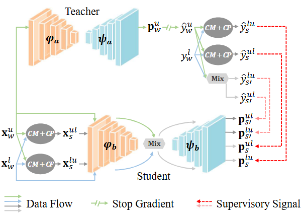

# CDA
This repository contains the official PyTorch implementation of the paper **Cross-Set Data Augmentation for Semi-Supervised Medical Image Segmentation**

# Abstract
Medical image semantic segmentation is a fundamental yet challenging research task. However, training a fully supervised model for this task requires a substantial amount of pixel-level annotated data, which poses a significant challenge for annotators due to the necessity of specialized medical expert knowledge. To mitigate the labeling burden, a semi-supervised medical image segmentation model that leverages both a small quantity of labeled data and a substantial amount of unlabeled data has attracted prominent attention. However, the performance of current methods is constrained by the distribution mismatch problem between limited labeled and unlabeled datasets. To address this issue, we propose a cross-set data augmentation strategy aimed at minimizing the feature divergence between labeled and unlabeled data. Our approach involves mixing labeled and unlabeled data, as well as integrating ground truth with pseudo-labels to produce augmented samples. By employing three distinct cross-set data augmentation strategies, we enhance the diversity of the training dataset and fully exploit the perturbation space. Our experimental results on COVID-19 CT data, pinal cord gray matter MRI data and prostate T2-weighted MRI data substantiate the efficacy of our proposed approach.

# The overall framework


# How to install
## 1. Data preparation
- COVID-19-20 

- SCGM

## 2. Environment configuration
- COVID-19-20 

- SCGM

# How to run
## 1. Training
- For COVID-19-20,

- For SCGM,

## 2. Testing
- For COVID-19-20,

- For SCGM,

# Acknowledgement
This project is based on the codes from the projects: [SASSL](https://github.com/FeiLyu/SASSL/) and [EPL](https://github.com/XMed-Lab/EPL_SemiDG).

Thanks a lot for their great works.

# Citation
If you use this code in your research, please kindly cite the following papers:

```bibtex
@article{wu2024cross,
  title={Cross-Set Data Augmentation for Semi-Supervised Medical Image Segmentation},
  author={Wu, Qianhao and Jiang, Xixi and Zhang, Dong and Feng, Yifei and Tang, Jinhu},
  journal={Image and Vision Computing},
  year={2024}
}


